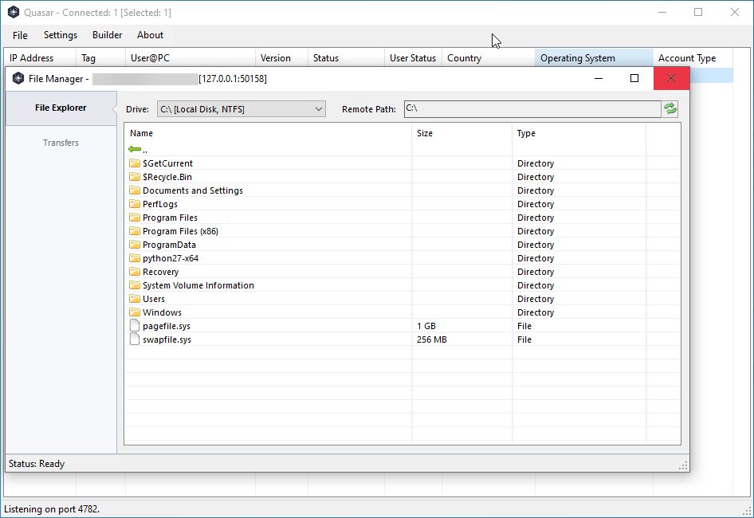

Free, Open-Source Remote Administration Tool for Windows

Quasar is a fast and light-weight remote administration tool coded in C#.
The usage ranges from user support through day-to-day administrative work 
to employee monitoring. Providing high stability and an easy-to-use user
interface, Quasar is the perfect remote administration solution for you.

## Screenshots

## Features

TCP network stream (IPv4 & IPv6 support)

Fast network serialization (Protocol Buffers)

Encrypted communication (TLS)

UPnP Support (automatic port forwarding)

Task Manager

File Manager

Startup Manager

Remote Desktop

Remote Shell

Remote Execution

System Information

Registry Editor

System Power Commands (Restart, Shutdown, Standby)

Keylogger (Unicode Support)

Reverse Proxy (SOCKS5)

Password Recovery (Common Browsers and FTP Clients)

... and many more!
